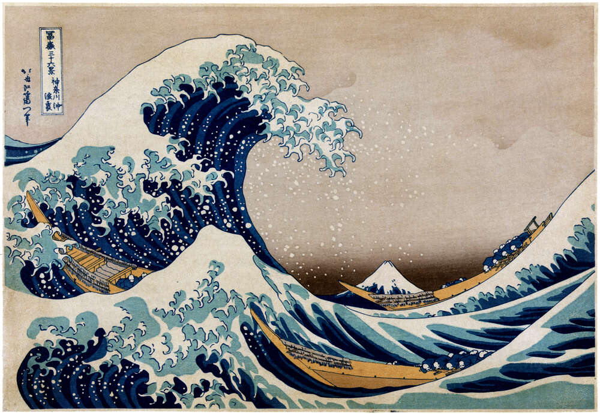
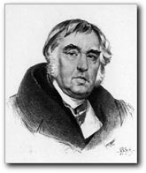

# Инструкция по работе с Markdown

## Выделение текста

Чтобы выделить текст курсивом необходимо обрамить его * или _ .
Например: *Курсив* или _Курсив_

Чтобы выделить текст полужирным необходимо обрамить его ** или __ .
Например: **Полужирный** или __Полужирный__

Разные способы выделения нужны, чтобы можно было их совмещать. Например: _Тексть может быть курсивом и одновременно **полужирным**_.

## Списки

Чтобы создать ненумерованный список, необходимо перед каждым элементом поставить * или + и пробел.
Например:

* Элемент 1
* Элемент 2
* Элемент 3
+ Элемент 4

Стобы создать нумерованный список, необходимо перед элементом поставить номер и точку.
Например:

1. Элемент А
2. Элемент В
3. элемент С

## Работа с изображениями

Чтобы встаивть изображение в текст достаточно написать восклицательный знак, квадратные скобки [в них должен быть текст на случай не вывода изображения], круглые скобки (в них указываем имя файла, если он находится в той же папке что и дайнный файл makrdown)

#### _**ВОЛНА**, Кацусика Хакусай_ 

## Ссылки

Для создания ссылки в markdown необходимо обрамить её в угловые скобки <>.  
Например: <https:www.lesovod.su>  

Для выделения части текста как ссылка необходимо: [Компания по спилу деревьем в Москве и Московской области.](http:www.lesovod.su)

Так же можно оформить всплывающую подсказку при наведении мышью, текст подсказке пишеться в ковычках:   
[Необходимо спилить аварийное дерево?](http:www.lesovod.su "Lesovod.SU Лучшая компания по работе с деревьями в Москве и Московской области!")

## Работа с таблицаим

Раздел находиться в разработке.

## Цитаты

Для обозначения цитат в язеке Markdown используют знак больше (>).
Например:

Басня Стрекоза и Муравей\
*Иван Андреевич Крылов*\

 >Попрыгунья Стрекоза  
Лето красное пропела;  
Оглянуться не успела,  
Как зима катит в глаза.  
Помертвело чисто поле;  
Нет уж дней тех светлых боле,  
Как под каждым ей листком  
Был готов и стол и дом.  
Всё прошло: с зимой холодной  
Нужда, голод настает;  
Стрекоза уж не поет:  
И кому же в ум пойдет  
На желудок петь голодный!  
Злой тоской удручена,  
К Муравью ползет она:  
"Не оставь меня, кум милый!  
Дай ты мне собраться с силой  
И до вешних только дней  
Прокорми и обогрей!"-  
"Кумушка, мне странно это:  
Да работала ль ты в лето?"-  
Говорит ей Муравей.  
"До того ль, голубчик, было?  
В мягких муравах у нас -  
Песни, резвость всякий час,  
Так что голову вскружило".-  
"А, так ты..." - "Я без души  
Лето целое всё пела".-  
"Ты всё пела? Это дело:  
Так пойди же, попляши!"  

## Заключение
В заключении хочется сказать: "Отличный язык этот ваш Марк Твен Даун!" 

Всем спасибо!
